# COMPUTER ASSISTED TRANSLATION CROSS-PLATFORM APP

 App developed using Ionic, an open source framework which provides tools and services for developing hybrid mobile, 
desktop, and progressive web apps based on modern web development technologies and practices, using Web technologies like CSS, HTML5, and Sass.

This project was designed from my own experience as a translator, thinking on those things 
I would have like to have to make translation easier and faster, I wanted to build something useful and user friendly.

It is not only a translation, but a management app as it covers two of the most important roles in translation process, translator and project manager.

## LOGIN
* Log in page with Google sign in option. As it is a cross platform app it is available for iOS, Android and browsers.

  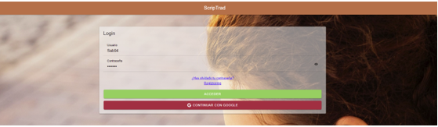

  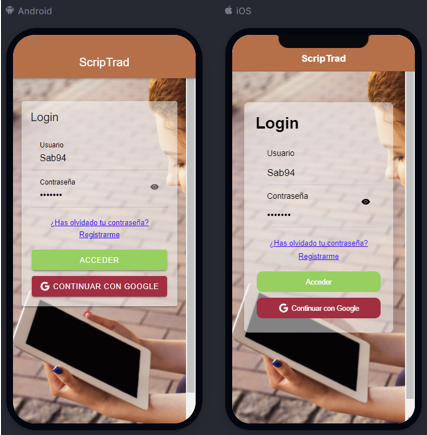

## REGISTER
* Register page for those using the app for the very first time. If using Google, there is a two steps registration to complete the user profile.

  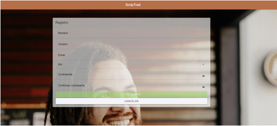

  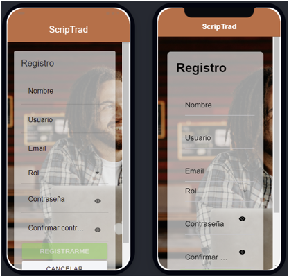

## PROJECT PAMAGER
### HOME
* Project manager homepage. Projects history and access to different options including menu and create projects.

  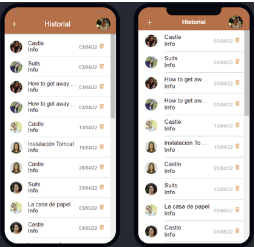

### NEW PROJECT
* Page for project managers to create and assign projects to available translators in DB.

  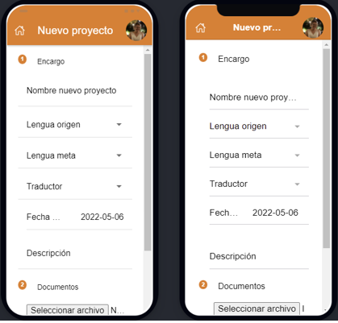

## TRANSLATOR
### HOME
* Translator homepage. Projects history and access to different options including translation page itself.

  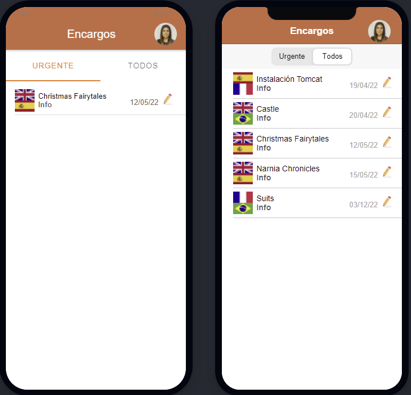

### TRANSLATION
Translator main page. Key features:
* Progress bar for the translator to easily see the the amount of work already done and how much there is still to do. 
* Segmented text to speed up the process.
* Option to generate an automatic translation based on the project languages.
* Glossary associated exclusively to that project.
* Comments section. A place for the translator to communicate relevant translation strategies and decisions.

  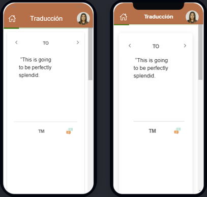

  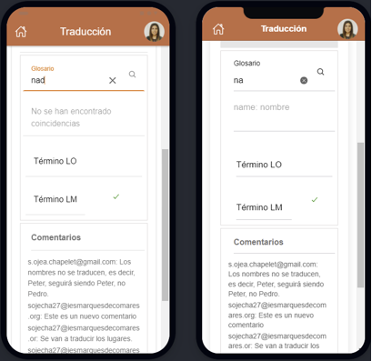

## MENU
* Shared menu for both roles to edit the user profile or change their password. 

  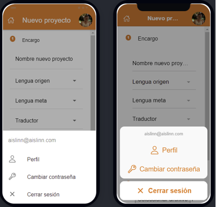

## USER PROFILE
* Page to edit profile information, e.g., username, name, photo.

  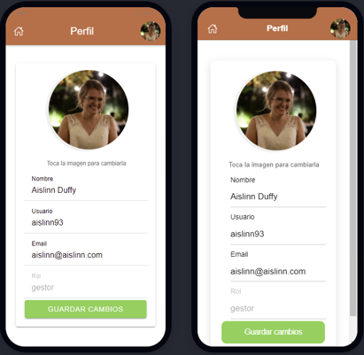

## PASSWORD
* It allows the logged user to change their password. For security matters, this is a two steps process:
first the user needs to type their current password; second, if the first step is successfull, it will ask the user to introduce
and confirm the new password in order to avoid possible typos.

  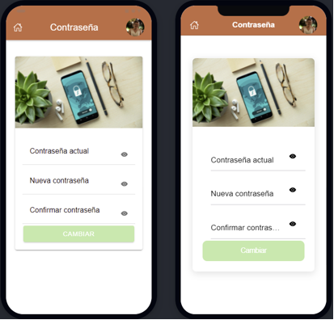

